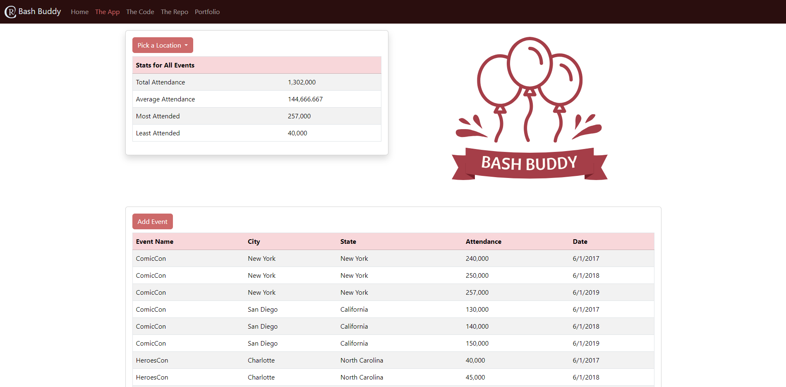

# Bash Buddy - A Coding Challenge

Bash Buddy is your best friend when it comes to displaying event data stats. Checkout the summary of stats from different Conventions and see how the stats update when you add your own events!

## Table of contents

- [Overview](#overview)
  - [Screenshot](#screenshot)
  - [Links](#links)
- [My process](#my-process)
  - [Built with](#built-with)
  - [What I learned](#what-i-learned)
  - [Possible Improvements](#possible-improvements)
  - [Useful resources](#useful-resources)
- [Author](#author)

## Overview

### Screenshot

Desktop Web App Screenshot:

Mobile Web App Screenshot:
 

### Links

- Live Site URL: [Netlify](https://fluffy-frangipane-3ef0bc.netlify.app/)
- Repo URL: [Github Repo](https://github.com/rebcop/MovieGarden)

## My process

### Built with

- CSS and Bootstrap Layout
- JavaScript Fundamentals
- JavaScript Loops
- JavaScript DOM Manipulation
- TECH STACK: JavaScript, HTML, CSS, Bootstrap

### What I learned

1. Use map to easily create an array of a spcific property from an array of objects.
2. Use set to provide an array that only contains unique values.
3. localStorage.setItem() & localStorage.getItem() allows for storing and then getting information in the browser as a JSON for an undetermined amount of time. This stoarge can be viewed and modified by anyone who has access to the same browserthe information was stored in.

### Possible Improvements
1. Ability to delete one / all events.
2. Ability to filter by Event Name / Type, Date.
3. Set up initial data with an API.

### Useful resources

- [Bootstrap Docs](https://getbootstrap.com/docs/5.3/getting-started/introduction/)
- [W3 Schools](https://www.w3schools.com/js/)
- [MDN Web Docs](https://developer.mozilla.org/en-US/docs/Web/JavaScript)

## Author

- Check out my portfolio - [Rebecca Copeland](https://rebcop.dev/)
- Message Me - [LinkedIn](https://www.linkedin.com/in/rebcop/)
